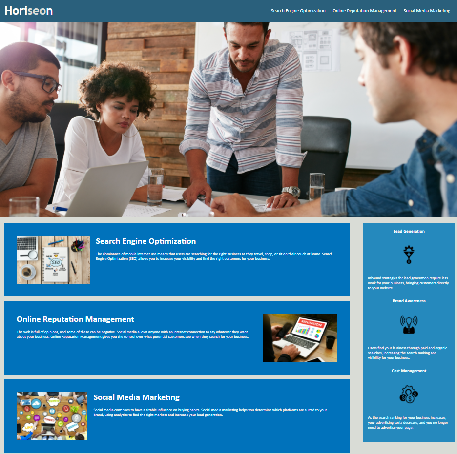

# Horiseon
> Outline a brief description of your project.
> Live demo [_here_](https://kabaothao.github.io/CodeRefactor/). <!-- If you have the project hosted somewhere, include the link here. -->

## Table of Contents
* [General Info](#general-information)
* [Technologies Used](#technologies-used)
* [Features](#features)
* [Screenshots](#screenshots)
* [Setup](#setup)
* [Usage](#usage)
* [Acknowledgements](#acknowledgements)
* [Contact](#contact)
<!-- * [License](#license) -->

## General Information
- This project is designed to prepare different scenarios when encounter on the job tickets or feature requests as a developer.
- What is the purpose of your project?
The purpose of this project is to restructure an existing body of code, altering its internal structure without changing its external behavior.
- Why did you undertake it?
To make the inefficent code to be more simpler, cleaner, and easier to understand. It also help developers to find the hidden bugs and vulnerabilites in the system.

<!-- You don't have to answer all the questions - just the ones relevant to your project. -->

## Technologies Used
- HTML5
- CSS
- Visual Studio

## Features
List the ready features here:
- Provided with starter code 

## Screenshots

<!-- If you have screenshots you'd like to share, include them here. -->

## Setup
- The URL of the deployed application.
- The URL of the GitHub repository. Give the repository a unique name and include a README describing the project.

## Usage
How does one go about using it?
- To restructure codes to the corrected classes in order to reduce redundacy.

For example:

.benefits div{
    margin-bottom: 32px;
    color: #ffffff;
}

.benefits div h3 {
    margin-bottom: 10px;
    text-align: center;
}

.benefits div img {
    display: block;
    margin: 10px auto;
    max-width: 150px;

.content div {
    margin-bottom: 20px;
    padding: 50px;
    height: 300px;
    font-family: 'Gill Sans', 'Gill Sans MT', Calibri, 'Trebuchet MS', sans-serif;
    background-color: #0072bb;
    color: #ffffff;
}

.content div img {
    max-height: 200px;
}

.content div h2 {
    margin-bottom: 20px;
    font-size: 36px;
}

## Acknowledgements
- This project was inspired by Trilogy Education.
- Many thanks to Trilogy Education.

## Contact
Created by [@kabaothao](https://github.com/kabaothao) - feel free to contact me!

<!-- Optional -->
<!-- ## License -->
<!-- This project is open source and available under the [... License](). -->

<!-- You don't have to include all sections - just the one's relevant to your project -->

